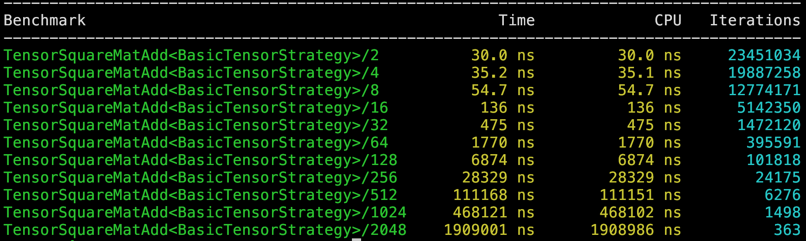
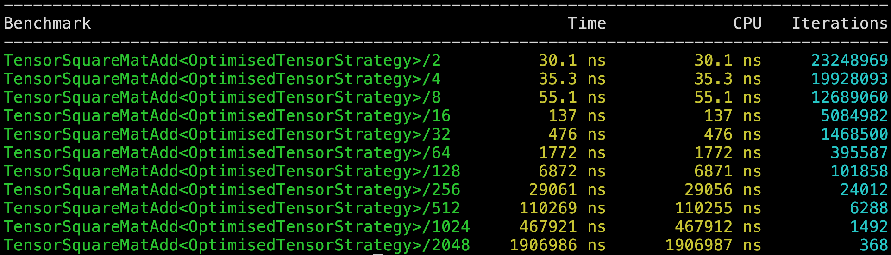
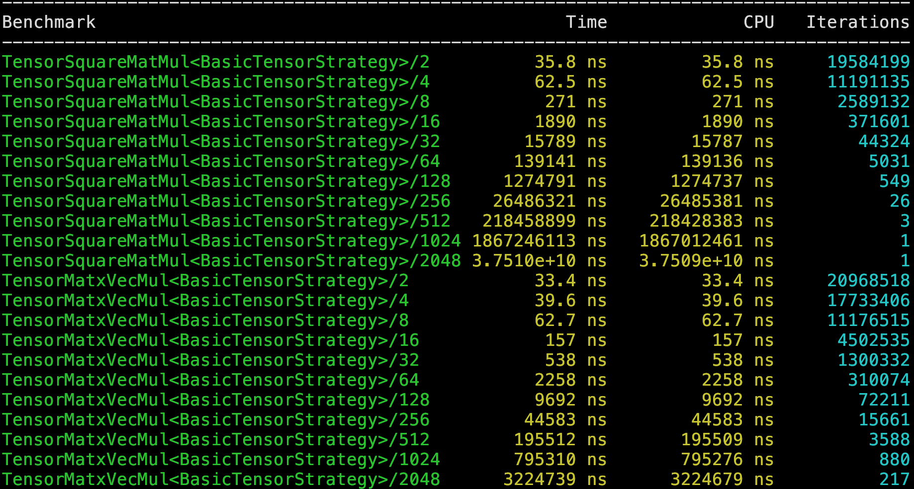
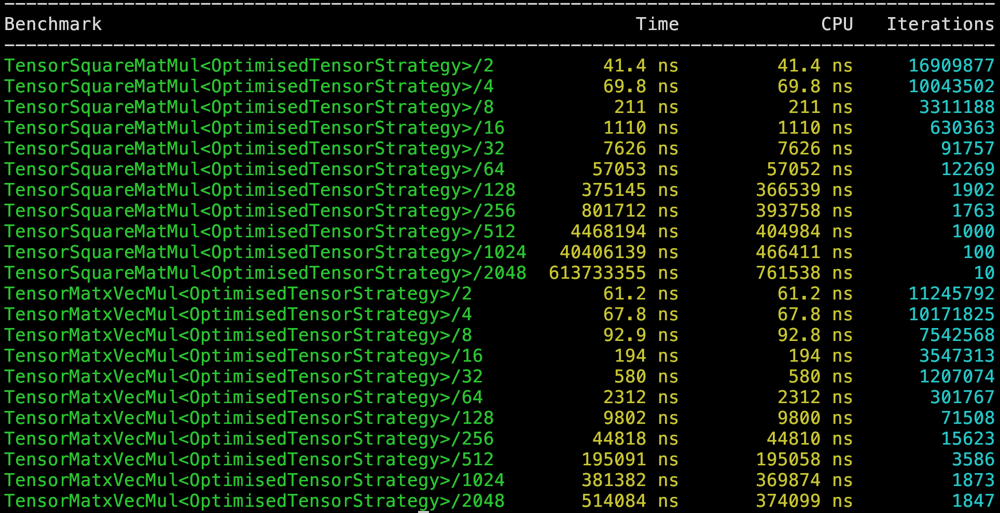

## Summary

AIInference aims to be a high-performance, minimal dependency machine learning library written in C++. The long-term goal is to provide efficient implementations of core ML algorithms and primitives from scratch.

Currently, the library features optimised matrix multiplication that performs **up to 61x faster** than a naive implementation. 

## Get Started

**Prerequisites:** CMake 3.20+, a C++20-compatible compiler (e.g. Clang or GCC), and an internet connection for the first build (Google Test and Google Benchmark are fetched automatically).

**Build and run:**

```bash
git clone https://github.com/SritejT/AIInference.git
cd AIInference
cmake -S . -B build
cmake --build build
./build/AIInference
```

**Run tests:**

```bash
ctest --test-dir build/tests --output-on-failure
```

**Run benchmarks:**

```bash
./build/mult_benchmarks
./build/add_benchmarks
```

Alternatively, use the provided script to build, test, and run in one step:

```bash
bash run.sh
```

## Performance

This is achieved through two key techniques:

- **SIMD (Single Instruction, Multiple Data)**: Uses ARM NEON vector instruction intrinsics to process 4 floating-point values in parallel within a single CPU instruction.
- **Multithreaded concurrency**: Distributes computation across CPU cores using two parallelisation strategies — row-parallel and block-parallel — automatically selected based on matrix size.

### Matrix Addition

**Naive implementation:**



**Optimised implementation:**



### Matrix Multiplication

**Naive implementation:**



**Optimised implementation:**



## Coming Soon

- **Further Matrix Operations** - subtraction, determinants, transpose, inverse, etc.
- **Linear regression** — training and inference for linear models.
- **Function optimisation** — gradient-based and derivative-free optimisation algorithms.

